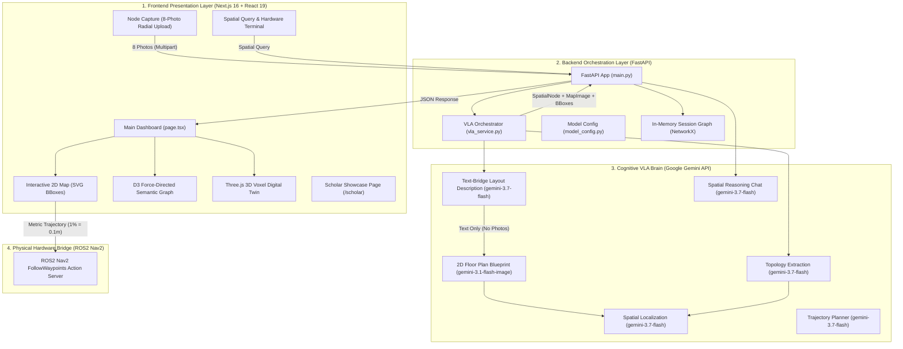

# 🤖 GeminiSpace (SPATIAL_OS) — System Design & Architecture Knowledge

You are operating within the **GeminiSpace (SPATIAL_OS)** repository — the 1st-place winning project from the **Gemini 3 Seoul Hackathon** (Google DeepMind, Cerebral Valley, AttentionX).

This project is a multi-layered, multimodal **Vision-Language-Action (VLA)** system that transforms 8 directional room photos into interactive 2D floor plans, 3D voxel twins, semantic topology graphs, and ROS2 robotic navigation trajectories using Google Gemini cloud models.

---

## 1. Multi-Layer System Architecture

The ecosystem spans four distinct architectural layers:



---

## 2. The 3-Step VLA Pipeline (Brain Invariants)

The core IP resides in `backend/vla_service.py`. When modifying or extending the pipeline, strictly enforce the **Text-Bridge invariant**:

### Step 1: Topology Extraction (`extract_topology`)
- **Input**: 8 sequential directional photos captured from the room center looking outward:
  - `0: N`, `1: NE`, `2: E`, `3: SE`, `4: S`, `5: SW`, `6: W`, `7: NW`.
- **Model**: `MODEL_TOPOLOGY` (`gemini-3.7-flash`).
- **Output**: Strict JSON containing `node_name`, `static_anchors`, `dynamic_objects`, and `navigable_edges`.

### Step 2: Text-Bridge Map Generation (`generate_birds_eye_view`)
- **Step 2a (Layout Description)**: Gemini analyzes the 8 photos + topology JSON to produce a purely geometric, textual description of the room boundaries and layout.
- **Step 2b (Image Synthesis)**: Passes **ONLY TEXT** to `MODEL_IMAGE` (`gemini-3.1-flash-image`) to generate a 16:9 orthographic 2D floor plan.
- **Invariant**: *Never pass raw photos directly to the image generation model.* Doing so causes 3D perspective hallucinations and perspective warping.

### Step 3: Spatial Localization (`locate_objects_in_map`)
- **Input**: Generated 2D floor plan image + list of detected objects/anchors.
- **Model**: `MODEL_LOCALIZATION` (`gemini-3.7-flash`).
- **Output**: Bounding boxes as percentages `(ymin, xmin, ymax, xmax)` in range `[0, 100]`.
- **Fallback**: Any undetected item automatically receives a bounding box computed from its camera direction index via `DIRECTION_PRESETS`.

---

## 3. Hardware Execution Loop (ROS2 Nav2 Dispatch)

1. **Target Selection**: User clicks an object or issues a natural language query in the UI.
2. **Metric Coordinate Mapping**: Visual map percentages are converted to real-world metric coordinates:
   $$\text{position\_x} = \text{center\_x\%} \times 0.1\,\text{m}, \quad \text{position\_y} = \text{center\_y\%} \times 0.1\,\text{m}$$
3. **Payload Serialization**: Trajectory is wrapped into a ROS2 `Nav2_FollowWaypoints` payload:
   ```json
   {
     "action": "Nav2_FollowWaypoints",
     "frame_id": "map",
     "waypoints": [
       {
         "header": { "frame_id": "map" },
         "pose": {
           "position": { "x": 4.5, "y": 2.1, "z": 0.0 },
           "orientation": { "x": 0.0, "y": 0.0, "z": 0.0, "w": 1.0 }
         }
       }
     ]
   }
   ```
4. **Hardware Dispatch**: Dispatched via POST request to the configured ROS2 REST endpoint (default: `http://localhost:8080/nav2/follow_waypoints`).

---

## 4. Development & Coding Rules

- **Model Centralization**: Never hardcode model strings in service files. Always import constants from `backend/model_config.py`.
- **JSON Parsing**: Gemini outputs may contain markdown fences (````json ... ````). Always parse via `_clean_and_parse_json()`.
- **API Client Layer**: Frontend components must never call `fetch()` directly. All requests must route through `frontend/app/lib/api.ts`.
- **Styling Tokens**: Cyberpunk / SLAM Operator aesthetic. Use CSS variables defined in `globals.css` (`--bg-primary`, `--accent: #00FF9D`, `--text-primary`).

---

## 5. 🚫 Forbidden Anti-Patterns

1. **Bypassing the Text-Bridge**: Do not pass raw images directly to the image generation model.
2. **Hardcoded Model Strings**: Do not write `"gemini-3.7-flash"` directly in route or service functions.
3. **Unsanitized JSON**: Do not use `json.loads(response.text)` without code-fence stripping.
4. **Float Coordinate Misinterpretation**: Do not treat bounding box coordinates as 0.0–1.0 floats; they are 0–100 percentages.
5. **Direct Fetch Calls**: Do not introduce raw `fetch()` calls inside React presentation components.
