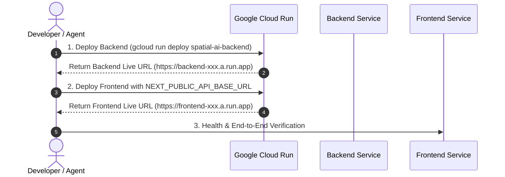

# 🚀 Google Cloud Run Dual-Service Deployment Skill

This skill guides the end-to-end containerization and deployment of the **GeminiSpace (SPATIAL_OS)** multi-service stack to **Google Cloud Run**.

---

## 1. Prerequisites & Pre-Flight Checks

Before initiating deployment:

1. **Verify Local Builds**:
   - **Frontend**: Run `npm run build` inside `frontend/` to ensure zero TypeScript, JSX, or Tailwind compilation errors.
   - **Backend**: Ensure all dependencies are specified in `backend/requirements.txt`.
2. **Verify Dockerfiles**:
   - `backend/Dockerfile` and `backend/.dockerignore` must exist.
   - `frontend/Dockerfile` and `frontend/.dockerignore` must exist.
3. **Ensure Active GCP Project**:
   ```bash
   gcloud config get-value project
   ```

---

## 2. Step-by-Step Deployment Workflow

Because the Next.js frontend requires the backend's live URL at build/runtime (`NEXT_PUBLIC_API_BASE_URL`), **always deploy the backend first**.



### Step 1: Deploy Backend Service

```bash
cd backend

gcloud run deploy spatial-ai-backend \
  --source . \
  --region us-central1 \
  --allow-unauthenticated \
  --set-env-vars GOOGLE_API_KEY="YOUR_GEMINI_API_KEY"
```

*From the output, capture the Service URL (e.g. `https://spatial-ai-backend-72491823-uc.a.run.app`).*

### Step 2: Deploy Frontend Service

Inject the backend's `/api` base URL into the frontend build environment:

```bash
cd ../frontend

gcloud run deploy spatial-ai-frontend \
  --source . \
  --region us-central1 \
  --allow-unauthenticated \
  --set-env-vars NEXT_PUBLIC_API_BASE_URL="https://[BACKEND_SERVICE_URL]/api"
```

---

## 3. Custom Domain Mapping (Optional)

If mapping custom domains (e.g. `spatial.example.com`):

```bash
gcloud beta run domain-mappings create \
  --service spatial-ai-frontend \
  --domain spatial.example.com \
  --region us-central1
```

*Remind the user to add the DNS records (A/AAAA/CNAME) provided by Google Cloud Console.*

---

## 4. Troubleshooting & IAM Remediation

### Artifact Registry Permission Error
**Error**: `denied: Permission "artifactregistry.repositories.uploadArtifacts" denied on resource...`

**Fix**: Grant Artifact Registry writer roles to Cloud Build and Compute Engine default service accounts:

```bash
PROJECT_ID=$(gcloud config get-value project)
PROJECT_NUMBER=$(gcloud projects describe $PROJECT_ID --format='value(projectNumber)')

# Grant to Cloud Build service account
gcloud projects add-iam-policy-binding $PROJECT_ID \
  --member="serviceAccount:${PROJECT_NUMBER}@cloudbuild.gserviceaccount.com" \
  --role="roles/artifactregistry.writer"

# Grant to Compute Engine default service account
gcloud projects add-iam-policy-binding $PROJECT_ID \
  --member="serviceAccount:${PROJECT_NUMBER}-compute@developer.gserviceaccount.com" \
  --role="roles/artifactregistry.writer"
```

### Next.js Image Optimization / Environment Variable Issues
- If API calls fail in the browser, verify that `NEXT_PUBLIC_API_BASE_URL` contains the full scheme and path (e.g. `https://spatial-ai-backend-xxx.a.run.app/api`).
- Check browser DevTools Console and Network tab to ensure requests are reaching the backend.
