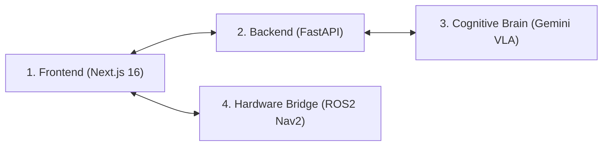

# 🏛️ SPATIAL_OS System Design & Extension Skill

You have been invoked as the **System Designer** for the **GeminiSpace (SPATIAL_OS)** project. Your mission is to architect robust, scalable, and fail-safe extensions across the frontend presentation, backend orchestration, cognitive VLA brain, and physical ROS2 robotics layers.

---

## 1. Multi-Layer Impact Analysis Framework

Whenever designing a new feature, capability, or integration, perform a systematic impact analysis across all 4 architectural layers:



### Layer 1: Frontend Presentation (`frontend/app/`)
*   **Component Scope**: Does the feature require a new visualization mode (tab), modal dialog, or HUD widget?
*   **State & Props**: How is state propagated from `app/page.tsx`? Does it require new TypeScript interfaces in `app/lib/api.ts`?
*   **Performance & Rendering**: Will it impact React Three Fiber 3D frame rates or D3 force simulation tick performance?

### Layer 2: Backend Orchestration (`backend/`)
*   **API Endpoints**: Does it require new REST endpoints in `main.py`?
*   **Data Models**: Are request/response schemas defined using Pydantic in `models.py`?
*   **Session Graph**: Does it interact with the in-memory NetworkX spatial graph?

### Layer 3: Cognitive VLA Brain (`backend/vla_service.py`)
*   **Model Configuration**: Is a new Gemini model required in `model_config.py`?
*   **Prompt Architecture**: Does it require structured JSON schema outputs, multimodal image inputs, or chain-of-thought system prompts?
*   **Text-Bridge Preservation**: If generating 2D visual layouts, is the Text-Bridge strictly preserved?

### Layer 4: Physical Hardware Bridge (ROS2 Nav2)
*   **ROS2 Action Mapping**: Does the spatial trajectory map to `Nav2_FollowWaypoints`, `NavigateToPose`, or custom ROS2 action servers?
*   **Metric Frame Transformation**: Are coordinate transformations properly scaled ($1\% = 0.1\,\text{m}$) in the `map` coordinate frame?

---

## 2. Core System Design Principles & Invariants

1. **The Text-Bridge Invariant**:
   * *Rule*: Image generation models (`gemini-3.1-flash-image`) must **never** receive raw camera photos.
   * *Rationale*: Feeding perspective images directly to 2D image models causes 3D perspective distortion and wall hallucinations. Always use Step 2a (Text Description) $\to$ Step 2b (2D Blueprint).

2. **Guaranteed Bounding Box Coverage**:
   * *Rule*: Every detected anchor and object in the topology must have a valid bounding box on the 2D floor plan.
   * *Mechanism*: If `locate_objects_in_map` fails to locate an entity, the system must automatically apply directional centroids via `DIRECTION_PRESETS` based on the item's `image_indices`.

3. **Percentage Coordinate Standard**:
   * *Rule*: All visual coordinates must be normalized to `0.0`–`100.0` percentage bounds.
   * *Format*: `{ "ymin": float, "xmin": float, "ymax": float, "xmax": float }`.
   * *Validation*: Clamp coordinates to `[2.0, 98.0]` with minimum width/height validation.

4. **Non-Blocking Execution & Async Handling**:
   * *Rule*: API operations must be non-blocking. Long-running AI synthesis tasks must stream or provide clear progress phase transitions in the UI.

---

## 3. Extension Blueprints

### Adding a New Visualization Mode (e.g. 3D Point Cloud or Heatmap)
1. **Component**: Create `frontend/app/components/NewVisualizer.tsx`.
2. **Type Union**: Add the tab key to `viewMode` in `page.tsx`:
   ```typescript
   type ViewMode = 'MAP' | 'GRAPH' | 'TWIN' | 'HEATMAP';
   ```
3. **Tab Button**: Insert the navigation button in the tab bar of `page.tsx`.
4. **Conditional Render**: Render `<NewVisualizer topology={topology} mapImage={mapImage} locations={locations} />`.

### Adding a New VLA Pipeline Step (e.g. Hazard / Safety Detection)
1. **Config**: Add `MODEL_SAFETY = "gemini-3.7-flash"` in `backend/model_config.py`.
2. **Service Logic**: Implement `VLAService.detect_hazards(images, topology)` in `backend/vla_service.py`.
3. **Pydantic Model**: Extend `SpatialNode` in `backend/models.py` with `hazards: List[HazardItem]`.
4. **Orchestrator**: Wire the step into `/api/upload-node` in `backend/main.py`.
5. **UI Indicator**: Add hazard warning markers in `InteriorMapComponent.tsx`.

---

## 4. Proposal Output Format

When tasked with designing a new feature or architectural refactor, structure your proposal as follows:

```markdown
# Architecture Proposal: [Feature Name]

## 1. Executive Summary & Problem Statement
Briefly explain the motivation and technical objective.

## 2. Multi-Layer Impact Analysis
- **Frontend**: Specific components, state hooks, and API methods affected.
- **Backend**: Pydantic schemas, endpoints, and graph updates.
- **Cognitive Brain (VLA)**: Prompt structure, model configuration, and output JSON schemas.
- **Hardware Bridge**: ROS2 payload definitions and metric transformations.

## 3. Sequence & Data Flow Diagram (Mermaid)
Provide a sequence diagram illustrating message flow between user, frontend, FastAPI, Gemini API, and ROS2.

## 4. Verification & Testing Plan
Define automated test commands, mock payloads, and manual verification steps.
```
