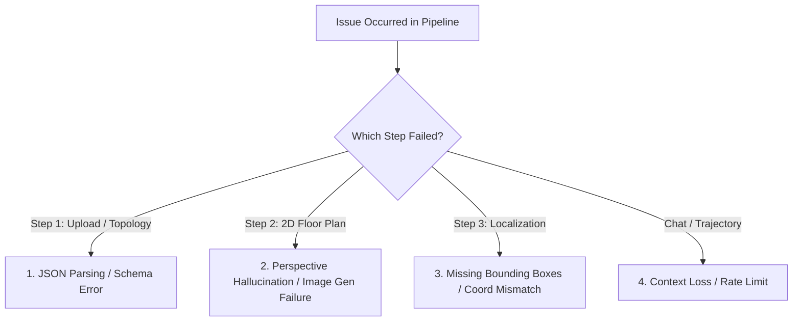

# 🔍 VLA Pipeline Debugging & Troubleshooting Runbook

This skill provides step-by-step diagnostic procedures, error signatures, and exact code remedies for the **GeminiSpace (SPATIAL_OS)** Vision-Language-Action pipeline.

---

## 1. Quick Diagnostic Flowchart



---

## 2. Failure Modes & Root-Cause Remedies

### Issue 1: Gemini JSON Decoding Failure (`json.JSONDecodeError`)
*   **Symptom**: Step 1 or Step 3 fails with `Expecting value: line 1 column 1 (char 0)` or malformed markdown output.
*   **Root Cause**: Gemini occasionally encapsulates JSON output in markdown formatting (` ```json ... ``` `) or precedes output with conversational preamble.
*   **Remedy**: Always use the robust regex extractor defined in `vla_service.py`:
    ```python
    def _clean_and_parse_json(raw: str):
        # Strip markdown fences
        cleaned = re.sub(r'```(?:json)?\s*', '', raw).strip()
        cleaned = re.sub(r'```\s*$', '', cleaned).strip()
        
        # Fallback regex search for outer JSON object or array
        match = re.search(r'(\[.*\]|\{.*\})', cleaned, re.DOTALL)
        if match:
            return json.loads(match.group(1))
        return json.loads(cleaned)
    ```

---

### Issue 2: 3D Perspective Hallucinations in 2D Floor Plans
*   **Symptom**: The generated bird's-eye map shows angled 3D walls, furniture heights, or perspective distortion instead of an orthographic top-down 2D floor plan.
*   **Root Cause**: Visual photos were passed directly to `MODEL_IMAGE` (`gemini-3.1-flash-image`), violating the **Text-Bridge invariant**.
*   **Remedy**: Ensure `generate_birds_eye_view` passes **ONLY the text layout description** generated in Step 2a (`extract_layout_description`) to the image generation model.

---

### Issue 3: Missing Bounding Boxes on Generated Floor Plans
*   **Symptom**: Certain objects/anchors exist in the topology JSON but have no bounding boxes displayed on the map overlay.
*   **Root Cause**: Visual object detector (`gemini-3.7-flash`) missed the object in the synthesized 2D floor plan image.
*   **Remedy**: Verify that the directional preset fallback is active in `vla_service.py`:
    ```python
    # Directional Fallback Map (Image Index 0:N -> 7:NW)
    DIRECTION_PRESETS = {
        0: (5, 35, 25, 65),    # North (Top Center)
        1: (5, 65, 25, 95),    # North-East (Top Right)
        2: (35, 75, 65, 95),   # East (Right Center)
        3: (75, 65, 95, 95),   # South-East (Bottom Right)
        4: (75, 35, 95, 65),   # South (Bottom Center)
        5: (75, 5, 95, 35),    # South-West (Bottom Left)
        6: (35, 5, 65, 25),    # West (Left Center)
        7: (5, 5, 25, 35),     # North-West (Top Left)
    }
    ```

---

### Issue 4: Visual Coordinate Bounds & Percentage Scaling
*   **Symptom**: Bounding box SVG overlays overflow the map canvas or appear misplaced.
*   **Root Cause**: Misunderstanding coordinate units. Coordinates are **0.0–100.0 percentages**, not 0.0–1.0 floats.
*   **Remedy**: Clamp all coordinates within `[2.0, 98.0]` and enforce minimum dimensions:
    ```python
    ymin = max(2.0, min(90.0, float(raw_ymin)))
    xmin = max(2.0, min(90.0, float(raw_xmin)))
    ymax = max(ymin + 5.0, min(98.0, float(raw_ymax)))
    xmax = max(xmin + 5.0, min(98.0, float(raw_xmax)))
    ```

---

### Issue 5: Windows `WinError 10054` (ConnectionResetError)
*   **Symptom**: Console throws unhandled `ConnectionResetError: [WinError 10054] An existing connection was forcibly closed by the remote host` when users refresh the Next.js browser page.
*   **Root Cause**: Windows asyncio proactor event loop raises exceptions when clients abort SSE/HTTP connections prematurely.
*   **Remedy**: Register a custom event loop exception handler in `backend/main.py`:
    ```python
    if sys.platform == "win32":
        def silence_winerror_10054(loop, context):
            exception = context.get("exception")
            if isinstance(exception, ConnectionResetError) or (
                hasattr(exception, "winerror") and exception.winerror == 10054
            ):
                return
            loop.default_exception_handler(context)

        asyncio.get_event_loop().set_exception_handler(silence_winerror_10054)
    ```

---

## 3. Systematic Verification Checklist

1. **Verify Backend**: Test endpoint directly via Swagger UI at `http://localhost:8000/docs`.
2. **Verify Quota**: Check Google AI Studio dashboard for rate limit depletion (HTTP 429).
3. **Verify Graph Memory**: Check `GET /api/graph` to confirm nodes and edges are properly registered in NetworkX.
4. **Verify Frontend Trajectory**: Inspect browser terminal logs to confirm ROS2 `Nav2_FollowWaypoints` serialization format.
