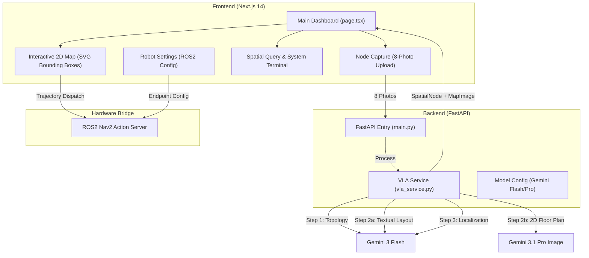

# SPATIAL_OS: Repository Architecture & Pipeline

This document summarizes the technical structure and data flow of the Gemini Indoor Navigator project.

## 1. System Architecture (High-Level)

---

## 2. The 3-Step VLA Pipeline (Brain)

The core logic resides in `backend/vla_service.py`, using a **Text-Bridge** architecture to ensure 2D accuracy and bypass 3D perspective hallucinations.

1.  **Topology Extraction** (`extract_topology`):
    - Uses `gemini-3-flash-preview`.
    - Converts 8 photos into a semantic graph (JSON) of furniture, exits, and spatial anchors.
2.  **Text-Bridge Layout Reconstruction**:
    - **Step 2a (`extract_layout_description`)**: Converts photos into a purely textual architectural description (Gemini Flash).
    - **Step 2b (`generate_birds_eye_view`)**: Passes *only* the text to the Image Generation model (Gemini Pro Image) to produce a 2D floor plan.
3.  **Object Localization** (`localize_objects`):
    - Uses `gemini-3-flash-preview`.
    - Correlates the generated 2D map with the topology to calculate `(xmin, ymin, xmax, ymax)` percentages for every object.

---

## 3. Repository Structure

### Backend (`/backend`)
- **`main.py`**: Handles `/upload-node`, chat memory, and image serving.
- **`vla_service.py`**: Orchestrates the multi-model pipeline and retry logic.
- **`model_config.py`**: Model selection (optimized Flash models for speed/reliability).
- **`models.py`**: Pydantic schemas for structural data.

### Frontend (`/frontend`)
- **`app/page.tsx`**: Central orchestrator for theme, font size, and visual state.
- **`components/`**:
    - **`NodeCaptureComponent.tsx`**: Octagonal upload UI with auto-synthesis trigger.
    - **`InteriorMapComponent.tsx`**: Renders the 2D map with interactive bounding boxes and "Send to Robot" logic.
    - **`CommandBarComponent.tsx`**: Chat interface with an integrated system terminal for hardware logs.
    - **`RobotSettingsModal.tsx`**: Configuration of the ROS2 Nav2 endpoint.
- **`lib/api.ts`**: Unified API client for backend communication.

---

## 4. Hardware Dispatch Flow (Trajectory Planning)

1.  **User Selects Target**: Clicks an object on the 2D map.
2.  **Coordinate Mapping**: Frontend converts map percentages to metric coordinates (1% = 0.1m).
3.  **Serialization**: Wraps coordinates into a standard ROS2 `Nav2_FollowWaypoints` payload.
4.  **Dispatch**: POSTs JSON to the configured robot endpoint.
5.  **Logging**: All events stream to the dashboard system terminal.
