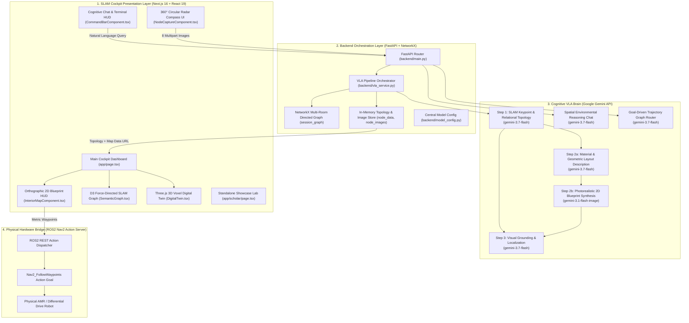
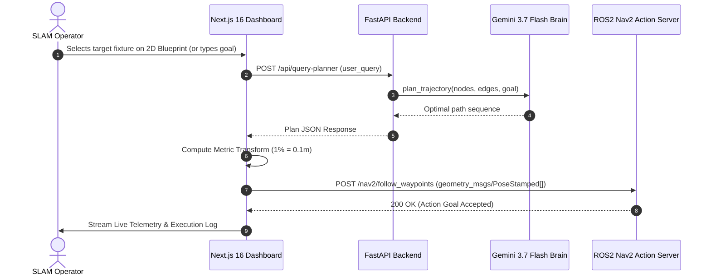

# 🌌 GeminiSpace (SPATIAL_OS) — System Architecture & Technical Specifications

> **Version**: 2.0.0  
> **Status**: Production Reference Document  
> **Target Audience**: AI Agents, Systems Engineers, and Robotics Architects  

---

## 1. System Overview & Core Philosophy

**GeminiSpace (Spatial OS)** is a **Vision-Language-Action (VLA)** cognitive spatial mapping and robotics operating system. It translates standard RGB panoramic imagery into orthographic blueprints, 3D voxel twins, topological relational property graphs, and physical ROS2 navigation waypoints.

### Core Architectural Axiom: The Text-Bridge
Passing raw perspective photographs directly into generative 2D image models causes severe **3D perspective distortions, non-coplanar walls, and severe geometric hallucinations**.

GeminiSpace enforces the **Text-Bridge Architecture**:
$$\text{8 Directional Images} \xrightarrow{\text{Step 1: SLAM Reasoning}} \text{Property Graph} \xrightarrow{\text{Step 2a: CAD Text}} \text{Architectural Spec} \xrightarrow{\text{Step 2b: Text-Only Generation}} \text{Orthographic 2D Blueprint}$$

> ⚠️ **CRITICAL INVARIANT**: Raw photographs must **never** be passed to `MODEL_IMAGE`. The intermediate geometric and material description in Step 2a isolates the image synthesis model from 3D camera distortion.

---

## 2. 4-Layer System Architecture Blueprint


```mermaid
graph TD
    subgraph Layer1["1. SLAM Cockpit Presentation Layer (Next.js 16 + React 19)"]
        UI_MAIN["Main Cockpit Dashboard (app/page.tsx)"]
        UI_RADAR["360° Circular Radar Compass UI (NodeCaptureComponent.tsx)"]
        UI_MAP["Orthographic 2D Blueprint HUD (InteriorMapComponent.tsx)"]
        UI_GRAPH["D3 Force-Directed SLAM Graph (SemanticGraph.tsx)"]
        UI_TWIN["Three.js 3D Voxel Digital Twin (DigitalTwin.tsx)"]
        UI_CHAT["Cognitive Chat & Terminal HUD (CommandBarComponent.tsx)"]
        UI_SCHOLAR["Standalone Showcase Lab (app/scholar/page.tsx)"]
    end

    subgraph Layer2["2. Backend Orchestration Layer (FastAPI + NetworkX)"]
        API_ROUTER["FastAPI Router (backend/main.py)"]
        SESSION_GRAPH["NetworkX Multi-Room Directed Graph (session_graph)"]
        DATA_STORE["In-Memory Topology & Image Store (node_data, node_images)"]
        VLA_ORCH["VLA Pipeline Orchestrator (backend/vla_service.py)"]
        MODELS_CONFIG["Central Model Config (backend/model_config.py)"]
    end

    subgraph Layer3["3. Cognitive VLA Brain (Google Gemini API)"]
        M_TOPO["Step 1: SLAM Keypoint & Relational Topology\n(gemini-3.7-flash)"]
        M_LAYOUT["Step 2a: Material & Geometric Layout Description\n(gemini-3.7-flash)"]
        M_IMAGE["Step 2b: Photorealistic 2D Blueprint Synthesis\n(gemini-3.1-flash-image)"]
        M_LOC["Step 3: Visual Grounding & Localization\n(gemini-3.7-flash)"]
        M_CHAT["Spatial Environmental Reasoning Chat\n(gemini-3.7-flash)"]
        M_PLAN["Goal-Driven Trajectory Graph Router\n(gemini-3.7-flash)"]
    end

    subgraph Layer4["4. Physical Hardware Bridge (ROS2 Nav2 Action Server)"]
        ROS2_DISPATCH["ROS2 REST Action Dispatcher"]
        ROS2_NAV2["Nav2_FollowWaypoints Action Goal"]
        ROBOT_HW["Physical AMR / Differential Drive Robot"]
    end

    %% Data Flow Connections
    UI_RADAR -->|8 Multipart Images| API_ROUTER
    API_ROUTER --> VLA_ORCH
    VLA_ORCH --> M_TOPO
    M_TOPO --> M_LAYOUT
    M_LAYOUT --> M_IMAGE
    M_IMAGE & M_TOPO --> M_LOC
    
    VLA_ORCH --> SESSION_GRAPH & DATA_STORE
    DATA_STORE -->|Topology + Map Data URL| UI_MAIN
    
    UI_MAIN --> UI_MAP & UI_GRAPH & UI_TWIN
    UI_CHAT -->|Natural Language Query| API_ROUTER
    API_ROUTER --> M_CHAT & M_PLAN
    
    UI_MAP -->|Metric Waypoints| ROS2_DISPATCH
    ROS2_DISPATCH --> ROS2_NAV2 --> ROBOT_HW
```

---

## 3. Mathematical & Geometric Formalisms

### 3.1. Visual SLAM Seam Keypoint Definition
Let $\mathcal{I} = \{I_0, I_1, \dots, I_7\}$ be the ordered sequence of 8 photos captured at angular bearings $\theta_i = i \cdot 45^\circ$.

Each adjacent pair $(I_i, I_{(i+1)\bmod 8})$ shares an overlapping visual field $\Omega_i = I_i \cap I_{i+1}$. A **Seam Keypoint** $K_i$ is an invariant visual feature within $\Omega_i$:

$$K_i = \left( \text{id}_i, [i, (i+1)\bmod 8], \theta_{K_i}, \mathbf{f}_i, d_i \right)$$

where:
* $\theta_{K_i} \in [0^\circ, 360^\circ)$ is the angular azimuth from room center.
* $\mathbf{f}_i$ is the invariant geometric visual descriptor (e.g. wall corner, doorpost, pillar edge).
* $d_i \in \mathbb{R}^+$ is the estimated radial distance in meters.

### 3.2. $360^\circ$ Loop Closure Constraint
To prevent angular drift and non-closing wall polygons, the seam between $I_7$ ($315^\circ$) and $I_0$ ($0^\circ$) must satisfy the loop closure identity:

$$\lim_{i \to 8^-} \sum_{k=0}^{7} \Delta \theta_{k, (k+1)\bmod 8} \equiv 0 \pmod{360^\circ}$$

The boundary of the room is mathematically modeled as an ordered polygon $\mathcal{P}$:
$$\mathcal{P} = \text{Polygon}(K_0, K_1, K_2, K_3, K_4, K_5, K_6, K_7)$$

### 3.3. Metric Coordinate Transformation
For any detected spatial entity $e$ with bounding box $[y_{\min}, x_{\min}, y_{\max}, x_{\max}]$ on the normalized $[0, 100\%]$ 2D map:

$$\text{Center}_x = \frac{x_{\min} + x_{\max}}{200}, \quad \text{Center}_y = \frac{y_{\min} + y_{\max}}{200}$$

Given a localized room metric dimension $(W_{\text{room}}, H_{\text{room}})$ (default $10.0\text{m} \times 10.0\text{m}$):

$$X_{\text{robot}} = \left( \text{Center}_x - 0.5 \right) \cdot W_{\text{room}} \quad [\text{meters}]$$

$$Y_{\text{robot}} = \left( 0.5 - \text{Center}_y \right) \cdot H_{\text{room}} \quad [\text{meters}]$$

The orientation quaternion is computed towards the entity centroid relative to vantage center $(0, 0)$:

$$\psi = \operatorname{atan2}(Y_{\text{robot}}, X_{\text{robot}}), \quad q_z = \sin\left(\frac{\psi}{2}\right), \quad q_w = \cos\left(\frac{\psi}{2}\right)$$

---

## 4. The 3-Step VLA Pipeline Execution

| Step | Function | Active Model | Input | Output | Invariant / Guardrail |
|---|---|---|---|---|---|
| **Step 1** | `VLAService.extract_topology` | `gemini-3.7-flash` | 8 $\times$ RGB Photos | `SpatialNode` JSON | Identifies 8 seam keypoints & validates loop closure |
| **Step 2a** | `VLAService.extract_layout_description` | `gemini-3.7-flash` | 8 Photos + Topology | Architectural CAD text | Extracts authentic surface materials (marble, brass, oak) |
| **Step 2b** | `VLAService.generate_birds_eye_view` | `gemini-3.1-flash-image` | **Pure text only** | 16:9 2D Data URL | Zero photos passed; strict $90^\circ$ overhead orthographic cutaway |
| **Step 3** | `VLAService.locate_objects_in_map` | `gemini-3.7-flash` | 2D Blueprint + Entity List | `List[ObjectLocation]` | Coordinate clamping $[2.0, 98.0\%]$ + 8-sector fallback presets |
| **Chat** | `VLAService.chat_with_environment` | `gemini-3.7-flash` | Query + Graph + History | Natural Language text | Grounded in topological property graph |
| **Planner** | `VLAService.plan_trajectory` | `gemini-3.7-flash` | Goal Query + Global Graph | Sequential Node Array | Optimal graph traversal path sequence |

---

## 5. Domain Schemas (`backend/models.py`)

```python
class SeamKeypoint(BaseModel):
    keypoint_id: str
    adjacent_pair: List[int]
    bearing_degrees: float
    visual_feature: str
    estimated_distance_m: Optional[float] = None

class LoopClosure(BaseModel):
    pair: List[int] = [7, 0]
    shared_landmarks: List[str] = []
    closure_verified: bool = True
    notes: Optional[str] = None

class StaticAnchor(BaseModel):
    anchor_id: str
    type: str
    cardinal_direction: Optional[str] = None
    description: str
    image_indices: List[int] = []
    associated_keypoints: List[str] = []

class DynamicObject(BaseModel):
    object_id: str
    type: str
    cardinal_direction: Optional[str] = None
    description: str
    image_indices: List[int] = []
    relative_to_keypoint: Optional[str] = None

class SpatialRelation(BaseModel):
    source: str
    relation: str  # adjacent_to, facing, behind, on_top_of, etc.
    target: str
    cardinal_direction: Optional[str] = None
    distance_estimate: Optional[str] = None

class RoomGeometry(BaseModel):
    shape: str = "rectangular"
    approx_dimensions: Optional[str] = None
    flooring_material: Optional[str] = None
    wall_finish: Optional[str] = None
    center_description: Optional[str] = None
    perimeter_keypoints_order: List[str] = []

class SpatialNode(BaseModel):
    node_name: str
    room_geometry: Optional[RoomGeometry] = None
    seam_keypoints: List[SeamKeypoint] = []
    loop_closure: Optional[LoopClosure] = None
    static_anchors: List[StaticAnchor] = []
    dynamic_objects: List[DynamicObject] = []
    spatial_relations: List[SpatialRelation] = []
    navigable_edges: List[NavigableEdge] = []
```

---

## 6. Failure Modes & Automated Mitigation Strategies

### 6.1. Visual Localization Misses
* **Symptom**: Step 3 fails to detect a bounding box for an entity present in the topology.
* **Mitigation**: `VLAService.locate_objects_in_map` enforces `DIRECTION_PRESETS`:
  $$\text{Sector}(i) = \begin{cases}
  0\text{ (N)}: & [10, 35, 32, 65] \\
  1\text{ (NE)}: & [10, 65, 32, 90] \\
  2\text{ (E)}: & [35, 65, 65, 90] \\
  3\text{ (SE)}: & [65, 65, 90, 90] \\
  4\text{ (S)}: & [65, 35, 90, 65] \\
  5\text{ (SW)}: & [65, 10, 90, 35] \\
  6\text{ (W)}: & [35, 10, 65, 35] \\
  7\text{ (NW)}: & [10, 10, 32, 35]
  \end{cases}$$
* Guarantees $100\%$ object localization coverage with zero unmapped entities.

### 6.2. Markdown Code Block Stripping
* **Symptom**: LLM wraps JSON outputs in ```json ... ``` fences.
* **Mitigation**: `_clean_and_parse_json()` applies regex extraction:
  ```python
  cleaned = re.sub(r"^```(?:json)?\s*", "", cleaned, flags=re.MULTILINE)
  cleaned = re.sub(r"\s*```$", "", cleaned, flags=re.MULTILINE)
  ```

### 6.3. Windows Asyncio Socket Handling
* **Symptom**: Browser reloads trigger `ConnectionResetError (WinError 10054)` on Windows.
* **Mitigation**: FastAPI `lifespan` handler injects `_silence_connection_reset` into the asyncio event loop.

---

## 7. Robotics Hardware Dispatch Flow


```mermaid
sequenceDiagram
    autonumber
    actor User as SLAM Operator
    participant UI as Next.js 16 Dashboard
    participant API as FastAPI Backend
    participant VLA as Gemini 3.7 Flash Brain
    participant ROS as ROS2 Nav2 Action Server

    User->>UI: Selects target fixture on 2D Blueprint (or types goal)
    UI->>API: POST /api/query-planner (user_query)
    API->>VLA: plan_trajectory(nodes, edges, goal)
    VLA-->>API: Optimal path sequence
    API-->>UI: Plan JSON Response
    UI->>UI: Compute Metric Transform (1% = 0.1m)
    UI->>ROS: POST /nav2/follow_waypoints (geometry_msgs/PoseStamped[])
    ROS-->>UI: 200 OK (Action Goal Accepted)
    UI->>User: Stream Live Telemetry & Execution Log
```

---

## 8. Verification & Quality Assurance

All architectural modifications must validate against the comprehensive test matrix:
1. **Pydantic Model Schema Integrity**: `python -m pytest backend/tests/test_models.py`
2. **VLA Pipeline Parsing & Fallbacks**: `python -m pytest backend/tests/test_vla_service.py`
3. **FastAPI Endpoints & Lifespan**: `python -m pytest backend/tests/test_api.py`
4. **Next.js Production Build**: `npm run build` inside `frontend/` (Zero TypeScript/CSS errors).
