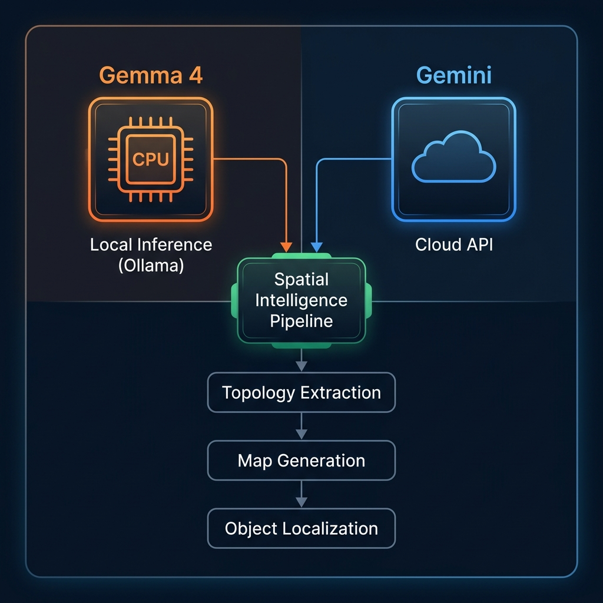
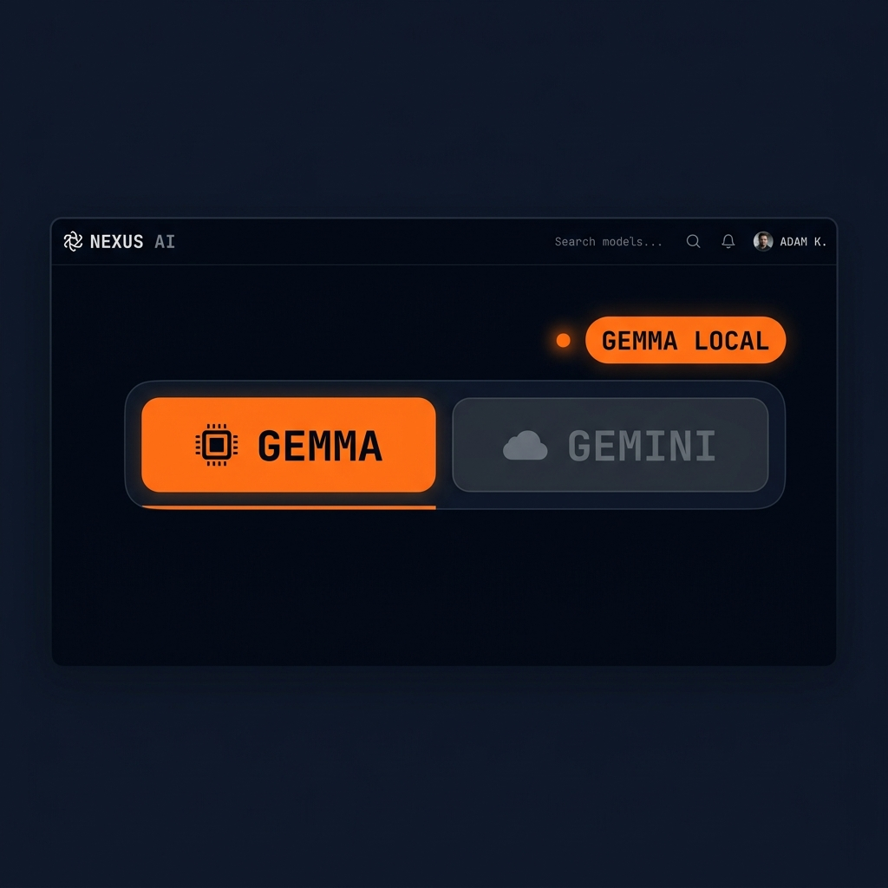

# 🗺️ Spatial OS — Indoor Navigator Powered by Gemini & Gemma 4

> **Google Indoor Navigation** — Capture 8 photos from the center of any room, and AI builds you a semantic map you can ask questions about.
> Now with **local-first inference** via Gemma 4 on Ollama! 🚀

---

## 🆕 Gemma 4 Local Inference

Spatial OS now supports **two inference engines** — run entirely on your local GPU with Gemma 4, or use the Gemini cloud API.



### Engine Toggle

Switch between engines with a single click in the header. The app locks the toggle during processing to prevent mid-flight switching.



| Engine | Icon | Speed | Privacy | GPU Required |
|--------|------|-------|---------|-------------|
| **Gemma 4** (Local) | 🟠 | ~60-80s per step | Full privacy, no data leaves your machine | Yes (8GB+ VRAM recommended) |
| **Gemini** (Cloud) | 🔵 | ~5-15s per step | Data sent to Google API | No |

> 💡 **Step 4** (image generation) always uses Gemini regardless of engine selection, since Gemma cannot generate images.

---

## What Is This?

Spatial OS is a **Vision-Language-Action (VLA)** system that turns ordinary room photos into an interactive indoor map. Think of it as **Google Maps Navigator, but for indoors**.

**How it works:**
1. 📸 Stand in the center of a room and capture **8 directional photos** (N, NE, E, SE, S, SW, W, NW)
2. 🧠 AI extracts a **semantic topology** (furniture, objects, pathways)
3. 🗺️ AI generates a **bird's-eye view floor plan** from the photos
4. 📍 Objects are **localized on the map** with interactive bounding boxes
5. 💬 Ask questions like *"Where is the coffee pot?"* or *"How do I get to the fridge from here?"*

---

## Quick Start

### Prerequisites
- Python 3.10+
- Node.js 18+
- A [Google AI Studio](https://aistudio.google.com/) API Key

### 1. Clone the Repo
```bash
git clone https://github.com/mincasurong/GeminiSeoulHackathon2026.git
cd GeminiSeoulHackathon2026
```

### 2. Set Up Your API Key
Create a `.env` file in the `backend/` folder:
```bash
echo GOOGLE_API_KEY=your_api_key_here > backend/.env
```
> 💡 Get your free API key at [aistudio.google.com/apikey](https://aistudio.google.com/apikey)

### 3. Install & Run Ollama (for Gemma 4 Local Mode)

Gemma 4 runs locally via [Ollama](https://ollama.com/), which manages model downloading and GPU inference automatically.

#### Step 1: Install Ollama

Download and install from **https://ollama.com/download**

| Platform | Install Command |
|----------|----------------|
| **Windows** | Download the installer from [ollama.com](https://ollama.com/download) |
| **macOS** | `brew install ollama` |
| **Linux** | `curl -fsSL https://ollama.com/install.sh \| sh` |

#### Step 2: Download Gemma 4 Model

```bash
ollama pull gemma4:e4b
```

> ⏳ This downloads ~5GB. Only needed once — Ollama caches the model locally.

#### Step 3: Verify Ollama is Running

```bash
ollama list
```

You should see:
```
NAME          ID              SIZE      MODIFIED
gemma4:e4b    abc123def456    5.0 GB    2 minutes ago
```

> 💡 Ollama runs as a background service on port `11434`. If it's not running, start it with:
> ```bash
> ollama serve
> ```

#### Step 4: Configure Backend for Ollama

Add these lines to your `backend/.env`:
```env
GOOGLE_API_KEY=your_api_key_here
OLLAMA_HOST=http://localhost:11434
OLLAMA_MODEL=gemma4:e4b
```

> ⚠️ **You still need a Google API Key** even in Gemma mode, because image generation (Step 4) uses Gemini.

### 4. Start the Backend
```bash
cd backend
python -m venv venv
.\venv\Scripts\activate        # Windows
# source venv/bin/activate     # Mac/Linux

pip install -r requirements.txt
uvicorn main:app --host 127.0.0.1 --port 8000
```
Backend runs on `http://localhost:8000`

### 5. Start the Frontend
```bash
cd frontend
npm install
npm run dev
```
Frontend runs on `http://localhost:3000`

### 6. Use the App
1. Open `http://localhost:3000`
2. Select your **engine** (Gemma or Gemini) using the toggle in the header
3. Upload **8 photos** (batch or individually) taken from the center of the room
4. Watch the **3-step progress indicator**:
   - ⏳ Step 1/3: Topology Extraction
   - ⏳ Step 2/3: Bird's-Eye Map Generation
   - ⏳ Step 3/3: Object Localization
5. Explore the results:
   - 🗺️ **MAP** — Interactive floor plan with clickable object boxes
   - 🔗 **GRAPH** — D3.js semantic relationship graph
   - 🧊 **TWIN** — 3D voxel digital twin view
6. **Download topology** — Click the `⬇ JSON` button to save the extracted data
7. Use the **Spatial Query Interface** to ask about the environment

---

## Architecture

```
┌──────────────────────────────────────────────────┐
│  Frontend (Next.js)     http://localhost:3000     │
│  ┌──────────┐ ┌──────────┐ ┌───────────────────┐ │
│  │ Upload   │ │ MAP /    │ │ Spatial Query     │ │
│  │ 8 Photos │ │ GRAPH /  │ │ Chat Interface    │ │
│  │[GEMMA|   │ │ TWIN     │ │ (engine-aware)    │ │
│  │ GEMINI]  │ │          │ │                   │ │
│  └────┬─────┘ └────▲─────┘ └────────┬──────────┘ │
└───────┼────────────┼────────────────┼────────────┘
        │            │                │
        ▼            │                ▼
┌──────────────────────────────────────────────────┐
│  Backend (FastAPI)      http://localhost:8000     │
│                                                  │
│  POST /api/upload-node?engine=gemma|gemini        │
│    Step 1: Topology     (Gemma 4 or Gemini)      │
│    Step 2: Map Gen      (Gemini image model)     │
│    Step 3: Localization (Gemma 4 or Gemini)       │
│                                                  │
│  POST /api/chat         (Gemma 4 or Gemini)      │
│  GET  /api/engines      (available engines)      │
└────────┬──────────────────────────┬──────────────┘
         │                          │
    ┌────▼─────┐              ┌─────▼────┐
    │  Ollama  │              │  Google  │
    │ Gemma 4  │              │  Gemini  │
    │ (local)  │              │  (cloud) │
    │ :11434   │              │  API     │
    └──────────┘              └──────────┘
```

## Models Used

| Pipeline Step | Gemma Mode | Gemini Mode |
|---|---|---|
| Topology Extraction | `gemma4:e4b` (Ollama) | `gemini-3-flash-preview` |
| Layout Description | `gemma4:e4b` (Ollama) | `gemini-3-flash-preview` |
| Bird's-Eye Map Image | `gemini-3.1-flash-image-preview` ⚡ | `gemini-3.1-flash-image-preview` |
| Object Localization | `gemma4:e4b` (Ollama) | `gemini-3-flash-preview` |
| Spatial Chat | `gemma4:e4b` (Ollama) | `gemini-3-flash-preview` |

> ⚡ Image generation always uses Gemini — Gemma 4 is text/vision-only.

---

## Project Structure

```
GeminiSeoulHackathon2026/
├── backend/
│   ├── main.py                # FastAPI server + engine router
│   ├── vla_service.py         # Gemini cloud pipeline
│   ├── local_gemma_service.py # Gemma 4 local pipeline (Ollama)
│   ├── test_local_gemma.py    # Unit tests for local inference
│   ├── requirements.txt       # Python dependencies
│   └── .env                   # API keys + Ollama config
├── frontend/
│   ├── app/
│   │   ├── page.tsx           # Dashboard with engine toggle
│   │   ├── components/
│   │   │   ├── NodeCaptureComponent.tsx   # 8-image upload + progress
│   │   │   ├── InteriorMapComponent.tsx   # Interactive floor plan
│   │   │   ├── SemanticGraph.tsx          # D3 relationship graph
│   │   │   ├── DigitalTwin.tsx            # 3D voxel view
│   │   │   └── CommandBarComponent.tsx    # Spatial chat
│   │   └── lib/api.ts         # API client (engine-aware)
│   └── package.json
├── docs/images/               # README images
├── manual.md                  # Detailed setup guide
├── .gitignore
└── README.md
```

---

## Example Queries

After processing a room, try asking:

- *"Where is the coffee pot?"*
- *"What objects are near the refrigerator?"*
- *"How can I get to the door from here?"*
- *"Describe the layout of this room"*
- *"What furniture is in this space?"*

---

## Troubleshooting

### Ollama Issues

| Issue | Solution |
|-------|---------|
| `Ollama not running` | Run `ollama serve` or start the Ollama desktop app |
| `Model not found` | Run `ollama pull gemma4:e4b` |
| `Slow inference` | First request loads model into VRAM (~30s). Subsequent requests use `keep_alive` for instant responses |
| `Out of VRAM` | Close other GPU-intensive apps, or switch to Gemini cloud mode |

### Backend Issues

| Issue | Solution |
|-------|---------|
| `ConnectionResetError (WinError 10054)` | Harmless Windows noise — suppressed automatically |
| `CORS error / Failed to fetch` | Ensure backend allows both port 3000 and 3001 |
| `503 UNAVAILABLE` (Gemini) | Gemini API rate limit — wait and retry, or switch to Gemma |

---

## Team

Built for the **Google Gemini Seoul Hackathon 2026** 🇰🇷

## License

MIT
