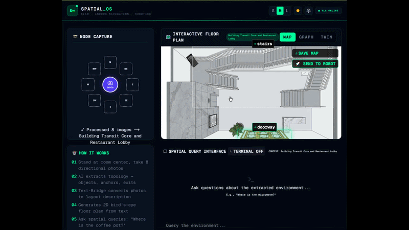

# 🌌 Spatial OS (GeminiSpace) — Vision-Language-Action Indoor Navigator

<div align="center">

[](https://cerebralvalley.ai/e/gemini-3-seoul-hackathon/hackathon/gallery?project=27)
[](https://blog.google/intl/ko-kr/company-news/inside-google/gemini-seoul-hackathon-first/)
[](https://www.youtube.com/watch?v=rZI6C7XsnY4)
[](https://fastapi.tiangolo.com)
[](https://nextjs.org)
[](https://ai.google.dev)

<br />

<p align="center">
  
</p> 

**An autonomous indoor spatial intelligence & robotics navigation operating system powered by Google Gemini.**  
*Transforms 8 ordinary panoramic smartphone photos into photorealistic 2D orthographic blueprints, 3D voxel digital twins, SLAM relational property graphs, and ROS2 robotic navigation trajectories.*

</div>

---

## 📑 Table of Contents

- [🏆 Hackathon Story & Origin](#-hackathon-story--origin)
- [💡 The Hard Tech Challenge](#-the-hard-tech-challenge)
- [🧠 The Core Breakthrough: 3-Step VLA Pipeline](#-the-core-breakthrough-3-step-vla-pipeline)
- [🔬 Visual SLAM Keypoint Tracking & Anti-Hallucination](#-visual-slam-keypoint-tracking--anti-hallucination)
- [🤖 Physical Robotics & ROS2 Hardware Bridge](#-physical-robotics--ros2-hardware-bridge)
- [🖥️ Cockpit Visualization Subsystems](#-cockpit-visualization-subsystems)
- [🏗️ System Architecture](#️-system-architecture)
- [⚡ Gemini Models Allocation](#-gemini-models-allocation)
- [🚀 Quick Start Guide](#-quick-start-guide)
- [📡 API Reference](#-api-reference)
- [🧪 Automated Test Suite](#-automated-test-suite)
- [☁️ Google Cloud Run Deployment](#️-google-cloud-run-deployment)
- [📂 Repository Structure](#-repository-structure)
- [📜 License](#-license)

---

## 🏆 Hackathon Story & Origin

**GeminiSpace (Spatial OS)** was created during the **Gemini 3 Seoul Hackathon** on **February 28, 2026** (hosted by **Google DeepMind**, **Google AI Studio**, **Cerebral Valley**, and **AttentionX** in Seoul, Korea).

Competing against 111 advanced AI engineering teams, GeminiSpace won **1st Place in the Gemini in Hard Tech Track**.

### 📰 Official Press & Links
* **Google Korea Official Blog Article:** [구글 블로그 인터뷰: "단 7시간 만에 혼자 구현하는 AI 공간 솔루션 완성"](https://blog.google/intl/ko-kr/company-news/inside-google/gemini-seoul-hackathon-first/)
* **Cerebral Valley Project Gallery:** [Project #27 — GeminiSpace (1st Place Winner)](https://cerebralvalley.ai/e/gemini-3-seoul-hackathon/hackathon/gallery?project=27)
* **YouTube Presentation & Demo:** [Watch the Live Hackathon Pitch on YouTube](https://www.youtube.com/watch?v=rZI6C7XsnY4)

---

## 💡 The Hard Tech Challenge

In smart factories, warehouses, healthcare facilities, and construction sites, deploying Autonomous Mobile Robots (AMRs) requires spatial mapping. Traditional **LiDAR-based SLAM (Simultaneous Localization and Mapping)** suffers from severe bottlenecks:

1. **Expensive Hardware Requirements**: High-precision LiDAR sensors and depth cameras cost thousands of dollars per robot.
2. **Labor-Intensive Pre-Scanning**: Human technicians must manually drive teleoperated sensor rigs through every hallway and room to generate point clouds.
3. **Rigid & Non-Semantic**: Point clouds represent raw geometric density but lack semantic comprehension (they cannot tell a refrigerator from an exit door, or an obstacle from a chair).
4. **Computationally Heavy**: Real-time point-cloud registration requires significant onboard compute and battery power.

**The GeminiSpace Thesis:**  
*What if a human or robot could stand at the center of any room, capture 8 regular photos with a standard RGB camera, and have an AI instantly construct a metric 2D floor plan, a 3D digital twin, a relational property graph, and executable ROS2 navigation waypoints in seconds?*

---

## 🧠 The Core Breakthrough: 3-Step VLA Pipeline

Feeding perspective camera photographs directly into 2D image generators causes severe **3D perspective distortions, hallucinated walls, and warped angles**. 

GeminiSpace invented the **Text-Bridge Architecture** to completely eliminate perspective distortion:

```mermaid
flowchart LR
    subgraph S1["Step 1: Topology Extraction"]
        P["8 Directional Photos\n(0:N → 7:NW)"] --> TOPO["Gemini 3.7 Flash\n(SLAM Keypoints & Property Graph)"]
    end

    subgraph S2["Step 2: Text-Bridge Map Synthesis"]
        TOPO --> S2A["Step 2a: Layout Description\n(Authentic Materials & Closed Polygon)"]
        S2A -->|Text Only (No Photos)| S2B["Step 2b: 2D Blueprint Synthesis\n(Gemini 3.1 Flash Image)"]
    end

    subgraph S3["Step 3: Object Localization"]
        S2B & TOPO --> LOC["Step 3: Visual Grounding\n(Gemini 3.7 Flash BBoxes)"]
    end

    LOC --> UI["Cockpit HUD & ROS2 Action Server"]

    style S1 fill:#0f172a,stroke:#00FF9D,stroke-width:2px
    style S2 fill:#0f172a,stroke:#38BDF8,stroke-width:2px
    style S3 fill:#0f172a,stroke:#A855F7,stroke-width:2px
```

1. **Step 1: Topology Extraction (`extract_topology`)**:  
   Analyzes 8 directional photos taken sequentially at $45^\circ$ increments from the room center ($0^\circ\text{ N} \to 315^\circ\text{ NW}$). Uses `gemini-3.7-flash` to extract a **Relational Spatial Property Graph** (static architectural fixtures, movable objects, exits, and visual SLAM keypoints).
2. **Step 2a: Material & Geometric Layout Description (`extract_layout_description`)**:  
   Translates the photos and topological property graph into a **purely textual architectural CAD specification**. It captures authentic floor finishes (*polished grey marble tiles, parquet oak*), wall materials (*brushed metal, travertine stone*), and exact metric clearances.
3. **Step 2b: Photorealistic 2D Floor Plan Synthesis (`generate_birds_eye_view`)**:  
   Sends the text-only layout description to `gemini-3.1-flash-image` (Nano Banana 2), generating a **16:9 orthographic 2D top-down floor plan rendering** with zero 3D perspective distortion.
4. **Step 3: Visual Grounding & Spatial Localization (`locate_objects_in_map`)**:  
   Correlates the generated 2D map with the extracted entities to compute $(y_{\min}, x_{\min}, y_{\max}, x_{\max})$ percentage-based bounding boxes with automatic directional fallbacks.

---

## 🔬 Visual SLAM Keypoint Tracking & Anti-Hallucination

To prevent spatial drift and hallucinated walls, GeminiSpace implements **Visual SLAM Seam Keypoint Tracking**:

* **Adjacent Overlap Seam Matching**: Adjacent photos have $\sim 25\text{--}35\%$ field-of-view overlap. The pipeline extracts invariant geometric keypoints across all 8 consecutive view pairs:
  $$\text{Seams: } [0, 1] \to [1, 2] \to [2, 3] \to [3, 4] \to [4, 5] \to [5, 6] \to [6, 7] \to [7, 0]$$
* **$360^\circ$ Loop Closure Constraint**: Image 7 (NW: $315^\circ$) and Image 0 (N: $0^\circ$) are matched to ensure closed-loop perimeter alignment without angular drift.
* **Keypoint-Anchored Entities**: Every object is anchored directly to its nearest invariant keypoint (`associated_keypoints` / `relative_to_keypoint`), mathematically constraining the floor plan geometry.

---

## 🤖 Physical Robotics & ROS2 Hardware Bridge

GeminiSpace converts high-level cognitive understanding into physical robotic motion.

### Metric Coordinate Mapping
Bounding box percentage coordinates $[0.0 - 100.0\%]$ on the orthographic 2D map are mapped to metric space in the robot's `map` coordinate frame ($1\% = 0.1\text{m}$, representing a $10\text{m} \times 10\text{m}$ normalized local room bounding box):

$$X_{\text{metric}} = \left(\frac{x_{\min} + x_{\max}}{2}\right) \times 0.1 \quad [\text{meters}]$$

$$Y_{\text{metric}} = \left(\frac{y_{\min} + y_{\max}}{2}\right) \times 0.1 \quad [\text{meters}]$$

### ROS2 Nav2 Action Dispatch Payload
When a destination is selected or a trajectory is planned, GeminiSpace serializes the coordinates into a standard **`geometry_msgs/PoseStamped`** array and dispatches it to the ROS2 Nav2 Action Server:

```json
{
  "action": "Nav2_FollowWaypoints",
  "frame_id": "map",
  "node_name": "Building Elevator Lobby and Stairwell",
  "waypoints": [
    {
      "header": { "frame_id": "map", "stamp": { "sec": 1772496000, "nanosec": 0 } },
      "pose": {
        "position": { "x": 5.00, "y": 2.10, "z": 0.0 },
        "orientation": { "x": 0.0, "y": 0.0, "z": 0.0, "w": 1.0 }
      }
    }
  ]
}
```

---

## 🖥️ Cockpit Visualization Subsystems

The frontend SLAM operator console provides 3 synchronized multi-modal perspectives:

1. **🗺️ Orthographic 2D Blueprint (`InteriorMapComponent.tsx`)**:
   * Interactive SVG bounding box overlays with hover telemetry.
   * Toggleable metric coordinate grid ($0.5\text{m}$ gridlines and origin reticle).
   * Direct correlated source photo gallery modal showing original camera views for any clicked entity.
2. **🔗 Relational Semantic Mesh (`SemanticGraph.tsx`)**:
   * D3.js force-directed physics graph with zoom and pan.
   * Diamond SLAM Seam Keypoints (`◆`) connected in a closed $360^\circ$ loop closure perimeter ring.
   * Inter-object relational dashed links (`adjacent_to`, `facing`, `behind`) in cyan.
3. **🧊 3D Voxel Digital Twin (`DigitalTwin.tsx`)**:
   * Three.js & `@react-three/fiber` voxel digital twin.
   * Instanced wall voxel extrusion, floor plane texture projection, and interactive camera orbit controls.
4. **🌐 Showcase Laboratory (`/scholar`)**:
   * Standalone offline showcase page with interactive blueprint simulation, live ROS2 payload inspector, and automated VLA Q&A playback controls.

---

## 🏗️ System Architecture

```
┌─────────────────────────────────────────────────────────────────────────┐
│  Presentation Layer: Next.js 16 + React 19 + Tailwind CSS + Framer     │
│  ├── 🧭 360° Circular Radar Compass Ingestion UI                        │
│  ├── 🗺️ Interactive 2D Orthographic Blueprint (SVG Overlays & Grid)    │
│  ├── 🔗 D3.js Force-Directed SLAM Property Graph                        │
│  ├── 🧊 Three.js 3D Voxel Digital Twin Visualizer                       │
│  ├── 🌐 /scholar — Standalone Showcase & Presentation Laboratory        │
│  └── 💬 Spatial Cognitive Chat & SLAM Kernel Terminal                   │
└────────────────────────────────────┬────────────────────────────────────┘
                                     │ HTTP / REST (Fetch API)
                                     ▼
┌─────────────────────────────────────────────────────────────────────────┐
│  Backend Orchestration Layer: FastAPI + NetworkX + Python 3.11          │
│  ├── POST /api/upload-node  ──► 3-Step VLA Pipeline Orchestrator        │
│  ├── POST /api/chat         ──► Multimodal Environmental Spatial Q&A    │
│  ├── POST /api/query-planner──► Goal-Driven Trajectory Graph Router     │
│  ├── GET  /api/graph        ──► Session Topological Graph               │
│  └── GET  /api/node/{id}    ──► Room Detail & Source Images             │
└────────────────────────────────────┬────────────────────────────────────┘
                                     │ Google GenAI SDK (google-genai)
                                     ▼
┌─────────────────────────────────────────────────────────────────────────┐
│  Cognitive VLA Brain: Google Gemini Cloud API                           │
│  ├── Step 1:  Topology Extraction         ──► gemini-3.7-flash          │
│  ├── Step 2a: Material & Layout Text      ──► gemini-3.7-flash          │
│  ├── Step 2b: 2D Blueprint Synthesis      ──► gemini-3.1-flash-image    │
│  ├── Step 3:  Spatial Localization        ──► gemini-3.7-flash          │
│  ├── Chat:    Environmental Reasoning     ──► gemini-3.7-flash          │
│  └── Planner: Trajectory Path Router      ──► gemini-3.7-flash          │
└────────────────────────────────────┬────────────────────────────────────┘
                                     │ ROS2 REST Action Dispatch
                                     ▼
┌─────────────────────────────────────────────────────────────────────────┐
│  Physical Hardware Layer: ROS2 Nav2 FollowWaypoints Action Server       │
└─────────────────────────────────────────────────────────────────────────┘
```

---

## ⚡ Gemini Models Allocation

All cognitive reasoning and localization steps are powered by **`gemini-3.7-flash`** for ultra-low latency, paired with **`gemini-3.1-flash-image`** for photorealistic top-down rendering:

| Pipeline Step | Model Identifier | Latency Profile | Role Description |
| :--- | :--- | :--- | :--- |
| **Topology Extraction** | `gemini-3.7-flash` | ~1–2s | 360° SLAM seam keypoints, loop closure & relational property graph |
| **Layout Description** | `gemini-3.7-flash` | ~1s | Material extraction, floor textures & keypoint-anchored layout |
| **2D Blueprint Synthesis** | `gemini-3.1-flash-image` | ~3–5s | Photorealistic 16:9 orthographic 2D top-down floor plan rendering |
| **Object Localization** | `gemini-3.7-flash` | < 1s | Percentage bounding box detection with fail-safe directional presets |
| **Spatial Reasoning Chat** | `gemini-3.7-flash` | < 1s | Interactive environmental Q&A grounded in spatial property graph |
| **Trajectory Planner** | `gemini-3.7-flash` | < 1s | Goal-driven multi-node trajectory path planning |

---

## 🚀 Quick Start Guide

### Prerequisites
* Python 3.10+
* Node.js 18+ or 20+
* A [Google AI Studio](https://aistudio.google.com/) API Key

### 1. Clone the Repository
```bash
git clone https://github.com/mincasurong/GeminiSeoulHackathon2026.git
cd GeminiSeoulHackathon2026
```

### 2. Configure API Key
Create a `.env` file in `backend/`:
```bash
echo GOOGLE_API_KEY=your_gemini_api_key_here > backend/.env
```

### 3. Start the Backend Server (Terminal 1)
```bash
cd backend
python -m venv venv
.\venv\Scripts\activate        # Windows PowerShell
# source venv/bin/activate     # macOS / Linux

pip install -r requirements.txt
uvicorn main:app --reload --port 8000
```
Backend runs on **http://localhost:8000** (Swagger API Docs at `/docs`).

### 4. Start the Frontend Dashboard (Terminal 2)
```bash
cd frontend
npm install
npm run dev
```
Frontend runs on **http://localhost:3000**.  
Showcase Presentation page is at **http://localhost:3000/scholar**.

---

## 📡 API Reference

### `POST /api/upload-node`
Initiates the 3-step VLA pipeline from 8 multipart directional photos.
* **Form Parameters**:
  * `node_name` (string): Room or floor identifier.
  * `images` (List[UploadFile]): Exactly 8 photos in sequential order (0:N $\to$ 7:NW).
  * `engine` (string, default `"gemini"`): Inference engine selector.
* **Response**: `UploadNodeResponse` (structured topology, synthesized floor plan data URL, object bounding boxes).

### `POST /api/chat`
Performs multimodal spatial reasoning grounded in the active room topology.
* **Payload**:
  ```json
  {
    "query": "Where is the nearest exit to the staircase?",
    "node_name": "Building Elevator Lobby and Stairwell",
    "history": []
  }
  ```
* **Response**: `{"response": "...", "node_name": "..."}`

### `POST /api/query-planner`
Plans a multi-room navigation path to a requested goal object.
* **Payload**:
  ```json
  {
    "user_query": "Navigate to the conference room",
    "current_node": "Building Elevator Lobby and Stairwell"
  }
  ```
* **Response**: `{"status": "success", "plan": ["Building Elevator Lobby...", "East Hallway", "Conference Room A"], "message": "..."}`

---

## 🧪 Automated Test Suite

The backend includes an automated **`pytest`** test suite covering schema serialization, SLAM keypoint validation, markdown parser fences, directional fallback bounds, and FastAPI route responses:

```bash
# Run backend test suite
python -m pytest backend/tests -v
```

```text
============================= test session starts =============================
platform win32 -- Python 3.12.1, pytest-8.4.1, pluggy-1.6.0
collected 12 items

backend/tests/test_api.py .....                                          [ 41%]
backend/tests/test_models.py ...                                         [ 66%]
backend/tests/test_vla_service.py ....                                   [100%]

============================= 12 passed in 3.62s ==============================
```

---

## ☁️ Google Cloud Run Deployment

Deploy the backend and frontend as containerized microservices on Google Cloud Run:

```bash
# 1. Deploy Backend Service
cd backend
gcloud run deploy spatial-ai-backend \
  --source . \
  --region us-central1 \
  --allow-unauthenticated \
  --set-env-vars GOOGLE_API_KEY="YOUR_KEY"

# 2. Deploy Frontend Service
cd ../frontend
gcloud run deploy spatial-ai-frontend \
  --source . \
  --region us-central1 \
  --allow-unauthenticated \
  --set-env-vars NEXT_PUBLIC_API_BASE_URL="https://spatial-ai-backend-xxxxx-uc.a.run.app/api"
```

---

## 📂 Repository Structure

```
GeminiSeoulHackathon2026/
├── .agents/                    # Persistent Agent Rules & Specialized Skills
│   ├── AGENTS.md               # Repository rules & pipeline invariants
│   ├── rules/system_knowledge.md
│   └── skills/                 # Architectural skills (Cloud Run, VLA Debugging, etc.)
├── .github/
│   └── workflows/ci.yml        # Automated GitHub Actions CI pipeline
├── backend/
│   ├── main.py                 # FastAPI endpoints & in-memory graph session
│   ├── vla_service.py          # 3-step VLA pipeline & SLAM keypoint logic
│   ├── model_config.py         # Centralized Gemini model configuration
│   ├── models.py               # Pydantic domain models
│   ├── tests/                  # Automated pytest test suite
│   │   ├── test_api.py
│   │   ├── test_models.py
│   │   └── test_vla_service.py
│   ├── requirements.txt        # Python dependencies
│   └── Dockerfile              # Cloud Run backend container
├── frontend/
│   ├── app/
│   │   ├── page.tsx            # SLAM cockpit operator console
│   │   ├── globals.css         # Cyber SLAM styling tokens & HUD effects
│   │   ├── scholar/            # Standalone /scholar showcase lab
│   │   ├── components/
│   │   │   ├── NodeCaptureComponent.tsx    # 360° Radar Compass upload UI
│   │   │   ├── InteriorMapComponent.tsx    # 2D Blueprint + BBoxes + Grid
│   │   │   ├── SemanticGraph.tsx           # D3.js SLAM Keypoint Property Graph
│   │   │   ├── DigitalTwin.tsx             # Three.js 3D Voxel Digital Twin
│   │   │   ├── CommandBarComponent.tsx     # Spatial Chat + System Terminal
│   │   │   └── RobotSettingsModal.tsx      # ROS2 endpoint configuration
│   │   └── lib/api.ts          # Centralized API client & TypeScript interfaces
│   ├── public/
│   │   └── topology.json       # Sample SLAM topological graph
│   └── Dockerfile              # Cloud Run frontend container
├── ARCHITECTURE.md             # In-depth architectural documentation
└── README.md                   # Project overview & documentation
```

---

## 📜 License

Distributed under the **MIT License**. Created for the **Google Gemini 3 Seoul Hackathon (February 28, 2026)**.
